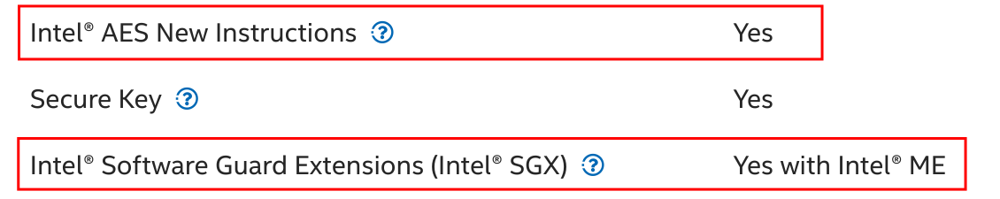
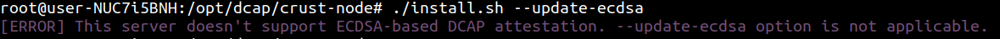
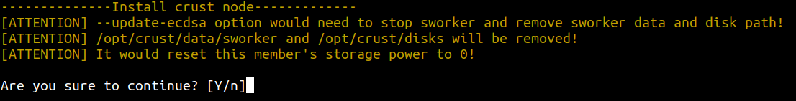
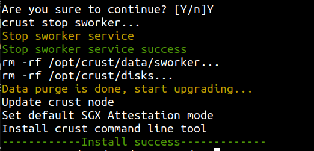

## 1. Overview

### EPID
Intel plans to end of life (EOL) the Intel SGX Attestation Service Utilizing Intel EPID (IAS for short) April 2, 2025. Refer to [here](https://www.intel.com/content/www/us/en/developer/articles/technical/software-security-guidance/resources/sgx-ias-using-epid-eol-timeline.html) for more information. 

### ECDSA
ECDSA-based attestation with Intel SGX DCAP allows providers to build and deliver their own attestation service instead of using the remote attestation service provided by Intel. This is a replacement for the IAS. Refer to [here](https://www.intel.com/content/www/us/en/developer/tools/software-guard-extensions/attestation-services.html) for more information. 

Crust has developed a ECDSA-based attestation service with Intel SGX DCAP. The github repo is [crust-dcap](https://github.com/crustio/crust-dcap). sWorker version >= 2.0.0 supports ECDSA-based DCAP attestation.

## 2. Migration Q&A

### 2.1 Do I need to migrate all servers to ECDSA-based DCAP attestation before April 2, 2025?

No. If sWorker runs normally after enter the network, it doesn't need to connect with the Intel IAS service. Therefore, as long as there is no need to re-enter the network (such as disk damage, system reinstallation, new server joining, etc.), the current version of sWorker can continue to use without migration.

### 2.2 Can all servers be upgraded to ECDSA-based DCAP attestation? <a id="server_support_ecdsa"></a>

No. Run the following command to check if your server supports ECDSA DCAP attestation:
```shell
cpuid | grep -i "SGX launch config"
```

Check if the command output is:

```shell
    SGX_LC: SGX launch config supported      = true
```

If the output is true, your server supports ECDSA DCAP attestation.

Refer to the following links to confirm if your server CPU model supports ECDSA DCAP attestation:

[Which Platforms Support Intel® SGX DataCenter Attestation Primitives (DCAP)](https://www.intel.com/content/www/us/en/support/articles/000057420/software/intel-security-products.html)

[Intel® Processors Supporting Intel® SGX](https://www.intel.cn/content/www/cn/zh/architecture-and-technology/software-guard-extensions-processors.html)


In summary, the following common CPU series support ECDSA DCAP attestation:

- Intel Xeon Scalable series processors >=3rd generation

    Note: Scalable series processors do not support EPID IAS, only ECDSA DCAP.

- Intel Xeon E/D series processors supporting SGX with Intel SPS feature

    Check the CPU official Spec to confirm the following feature:
    
    

    Note 1: This series of processors can support both EPID IAS and ECDSA DCAP.
    
    Note 2: Processors supporting SGX with Intel ME feature only support EPID IAS, not ECDSA DCAP.

- 8th, 9th, and 10th generation Intel Core processors supporting SGX + AES-NI feature

    Check the CPU official Spec to confirm the following feature:
    
    
    
    Note 1: This series of processors can support both EPID IAS and ECDSA DCAP.
    
    Note 2: 11th generation (inclusive) and later Core processors no longer support SGX feature, so neither EPID IAS nor ECDSA DCAP is available.

### 2.3 Why does the 'SGX launch config' output still show false even though my server CPU model supports SGX and DCAP?

In addition to meeting the CPU model requirements, SGX and DCAP features also require BIOS support. 

Please check the BIOS settings or upgrade the corresponding BIOS version. For details, please contact the technical support of the server supplier.

### 2.4 My server supports ECDSA DCAP, and is running the old version of sWorker based on EPID attestation. Now re-entry network is needed, how do I migrate to ECDSA-based DCAP attestation?

Please refer to [3. Migration Guide](#migration_guide)

### 2.5 My server supports ECDSA DCAP and is a new server. How do I deploy from scratch?

Please refer to [Member Node](memberNode.md) or [Isolation Node](isolationNode.md) for deployment installation. 

Crust Node version 2.0.0+ supports automatic recognition and use of ECDSA DCAP attestation mode.

### 2.6 My server doesn't support ECDSA DCAP, and is running the old version of sWorker based on EPID attestation. Now re-entry network is needed, how should I do?

If it is before April 2, 2025, you can still use EPID IAS for entry network attestation, and all currently effective sWorker versions can be used.

If it is after April 2, 2025, since the Intel IAS service has stopped, and the server itself does not support ECDSA DCAP, this server can no longer entry the network and needs to purchase a new server that supports ECDSA DCAP. You can then migrate the hard disks to the new server, and then redeploy to entry the network.

Note: For miners who need to purchase new servers to join in 2024, please be sure to purchase servers that support DCAP according to the contents of [section #2.2](#server_support_ecdsa) and the reference link, to ensure that you can still entry the network after the Intel IAS service stops.

## 3. Migration Guide <a id="migration_guide"></a >

### 3.1 Upgrade Crust Node to the latest installation package

a. Download

Make sure the version number of the installation package is >= 2.0.0

```shell
wget https://github.com/crustio/crust-node/archive/v2.0.0.tar.gz
```

b. Unzip

```shell
tar -xvf v2.0.0.tar.gz
```

c. Enter the installation directory

```shell
cd crust-node-2.0.0
```

### 3.2 Migration Upgrade

Execute the following command for upgrade

```shell
sudo ./install.sh --update-ecdsa
```

The script first checks whether the current server supports ECDSA DCAP attestation. If not, it will prompt the following information and exit:



If the current server supports ECDSA DCAP attestation, it will prompt that the sworker would be stopped and existing sworker data would be purged, and it requires confirmation to execute:

[Note] This operation will reset the storage power of the member node to 0, and will need to re-entry the network and SRD. After data is purged, it cannot be recovered, please confirm before operation.



Seeing the following display means the upgrade was successful:



### 3.3 Restart sWorker
Restart sWorker and observe the logs to see if it has successfully entry the network based on ECDSA DCAP:

```shell
sudo crust start sworker
sudo crust logs sworker
```

After confirming that the entry network is successful, re-execute SRD:

```shell
sudo crust tools change-srd {number}
```

After the SRD task is completed, sWorker will resume normal operation.